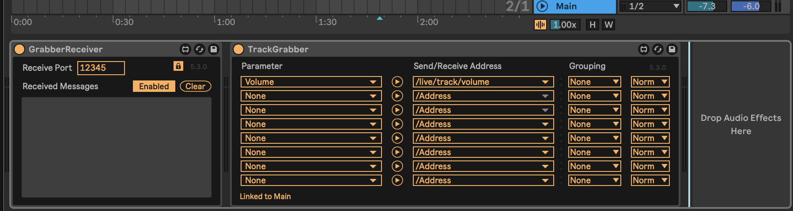
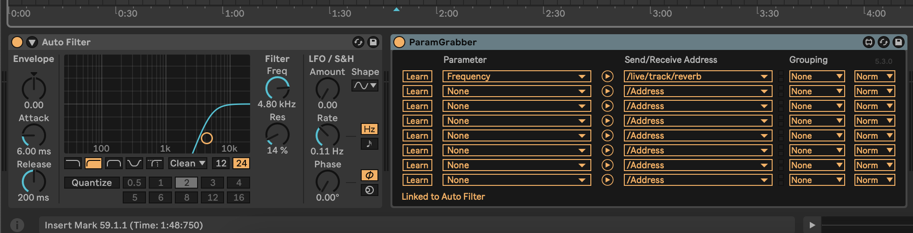

## Welcome to HandAutoMation

This project uses **OpenCV** and **MediaPipe** for real-time hand tracking and sends control data to **Ableton Live** using **OSC (Open Sound Control)**. The distance between your **thumb and index finger** is measured and mapped to parameters inside Ableton, enabling **gesture-based music control**.

---
**LIVE DEMO**: https://drive.google.com/file/d/1SOpbyPH2KmkuV2kpRt7YPfQSAo2Uxdye/view?usp=sharing
---

## Features
✅ **Real-time hand tracking** using OpenCV & MediaPipe  
✅ **Calculates distance** between thumb & index finger  
✅ **Detects Left & Right hands separately**  
✅ **Sends OSC messages** to Ableton Live for MIDI-like control  
✅ **Gesture-based music modulation** (e.g., volume, filter cutoff, effects)

---

## Tech Stack
- **OpenCV**: Captures video from the MacBook camera
- **MediaPipe**: Detects hands and tracks 21 key landmarks
- **NumPy**: Calculates Euclidean distance between fingers
- **OSC (Open Sound Control)**: Sends control data to Ableton Live

---

## Requirements
- **Ableton Live With Max For Live**
- **LiveGrabber Plugins for Ableton: DOWNLOAD HERE: https://www.showsync.com/tools#livegrabber**
- **Python with dependencies (install requirements.txt)**

## How-To:
- Install LiveGrabber Plugins into Ableton Live: **https://www.showsync.com/tools#livegrabber**
- Place GrabberReceiver plugin on main channel, set receive port to **12345**
- For volume automation with right hand, place TrackerGrabber plugin on main channel, volume as parameter and send/receive address as **'/live/track/volume'**. Doing so will look like this:

- **You can now control the volume with your right hand, using thumb and index fingers**

- For effect automation (you can use any effect automation), place your effect plugin and ParamGrabber plugin on any track rack that you want to control.
- You can set parameter to anything that you want in plugin, in this case it is set to frequency. Set send/receive address to **'/live/track/reverb'**. Doing so will look like:

- **You are then all set! Run the program and you will have control of the volume with right hand and control of the effect plugin with left hand**

-**NOTE: use testfunctions.py to test if OSC messages are going through to Ableton Live.**

